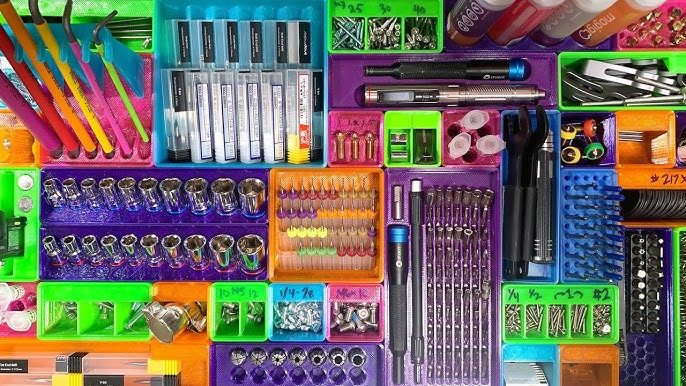
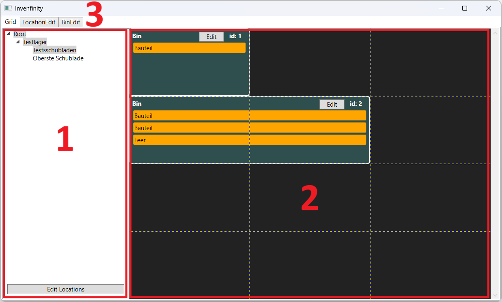
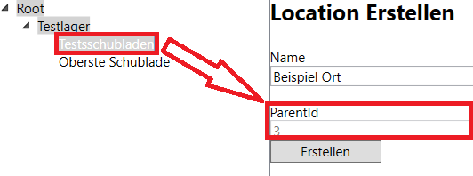
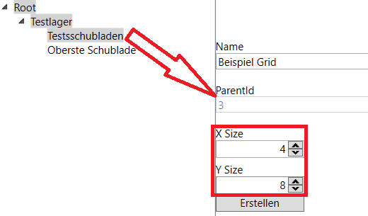
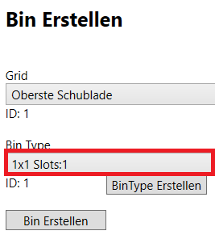
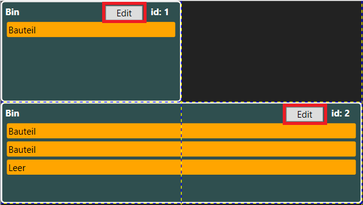
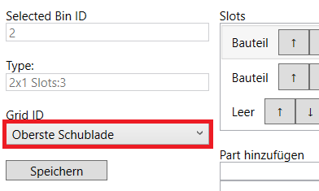
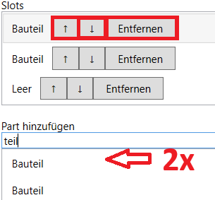

# Invenfinity - Benutzerhandbuch

Willkommen beim Benutzerhandbuch für **Invenfinity**, Ihrer Software zur effizienten Verwaltung von modularen Lagersystemen.


## Inhalt

1. [Lagerphilosophie](#lagerphilosophie)
2. [Datenstruktur](#datenstruktur)
3. [Bedienoberfläche](#bedienoberfläche)
4. [Locations verwalten](#locations-verwalten)
5. [Grids verwalten](#grids-verwalten)
6. [Bins verwalten](#bins-verwalten)
7. [Parts verwalten](#parts-verwalten)
8. [Mögliche Fehler](#mögliche-fehler)
9. [Hinweise & Zukünftige Funktionen](#hinweise--zukünftige-funktionen)

## Lagerphilosophie

Diese Software dient zur Verwaltung eines modularen Lagersystems basierend auf **Gridfinity**.

### Was ist Gridfinity?

Gridfinity ist ein Open-Source-Boxensystem. Das System baut auf einem 42x42mm Raster (**Grid**) auf und bietet mehr als ca. 100.000 Box-Typen (**BinTypes**). Eine Box (**Bin**) kann dabei ein oder mehrere Felder des Grids nutzen.


[Quelle](https://www.youtube.com/watch?v=ra_9zU-mnl8)

### Grundprinzip

* **Standardisierte Raster:** Einheitliche Grids für maximale Kompatibilität.
* **Modulare Boxen:** Flexible Bins für unterschiedliche Anforderungen.
* **Flexible Inhalte:** Dynamische Zuweisung von Parts.
* **Hierarchische Lagerorte:** Strukturierte Organisation über Lagerorte (**Locations**).

**Ziel:** Eine klare, skalierbare und visuell erfassbare Lagerstruktur.

## Datenstruktur

Das System ist streng hierarchisch aufgebaut, um eine logische Abbildung der physischen Welt zu ermöglichen:

``` txt
Location
└── Location (Unterort)
└── Grid
    └── Bin
        └── Part
```

### Definitionen

* **Location:** Repräsentiert einen physischen Ort (Raum, Schrank, Regal). Kann weitere Locations oder Grids enthalten.
* **Grid:** Ein Raster innerhalb einer Location, definiert durch **X-** und **Y-Größe**.
* **Bin:** Ein physischer Behälter im Grid mit fester Position und Größe. Enthält Slots für Parts.
* **BinType:** Definiert die Dimensionen (z.B. `2x1 Slots:3`).
* **Part:** Der eigentliche Inhalt eines Bins, der einem Slot zugewiesen wird.

## Bedienoberfläche

Die Anwendung unterteilt sich in drei Hauptbereiche:



1. **Navigation (links):** Eine Baumstruktur aller Locations. Die Auswahl steuert die restlichen Ansichten.
2. **Grid-Ansicht (Mitte):** Visuelle Darstellung des Grids. Zeigt Bins, deren Positionen und Inhalte direkt an.
3. **Edit-Tabs (Rechts/Kontext):**
   * *Grid:* Ansicht und Layout des Grids.
   * *LocationEdit:* Bearbeitung von Strukturen und Grids.
   * *BinEdit:* Bearbeitung von Bins und Zuweisung von Parts.

## Locations verwalten

### Location erstellen

1. **LocationEdit** öffnen.
2. Auf **"Neue Location"** klicken.
3. Name vergeben und ggf. eine `ParentId` setzen, indem Sie in dem Baum den Parent auswählen.

    

4. **"Erstellen"** klicken.

### Location bearbeiten/löschen

* Wählen Sie die Location im Baum aus, passen Sie die Werte an und speichern Sie.
* **Hinweis beim Löschen:** Damit eine Location oder Grid gelöscht werden kann, darf sie keine Sub-Locations und Grids haben.

## Grids verwalten

### Grid erstellen

1. Auf **"Neues Grid"** klicken.
2. Name vergeben und eine `ParentId` setzen, indem Sie in dem Baum den Parent auswählen.
3. **X Size** und **Y Size** (Anzahl der 42mm Einheiten) setzen.

    

4. **"Erstellen"** klicken.

**Hinweis:** Das Verwalten der Bins im Grid wird später behandelt.

## Bins verwalten

### Bin erstellen

1. **BinEdit** öffnen und **"Bin erstellen"** klicken.
2. Passendes **Grid** oder `Empty` auswählen.
3. Passenden **BinType** auswählen.

    

4. **"Bin Erstellen"** klicken.

### Bin im Grid verschieben

1. *Grid* öffnen.
2. Bin mit Drag&Drop verschieben.

Speichern ist nicht notwendig.

### Bins zwischen Grids verschieben

1. *Grid* öffnen.
2. In der relevanten Bin auf **"Edit"** klicken.

    

3. Das Feld **"Grid ID"** bearbeiten.

    

4. **"Speichern"** klicken.

**Hinweis**: Beim Verschieben werden nur Grids angezeigt, die ausreichend Platz haben.

### Gridless Bin

Ist eine Bin dem Grid `Empty` zugeordnet, ist es eine Gridless Bin. Diese lassen sich über das Dropdown auf der Seite *BinEdit* bearbeiten.
Dieses vereinfacht das Verschieben von Bins und bietet einen einfachen Zwischenspeicher.

### Bin Löschen

1. Bin auswählen (Über Gridless Bins oder über *Grid* Tab)
2. Slots der Bin leeren (siehe [hier](#bins-verwalten))
3. **"Grid ID"** auf `Empty` setzen.
4. **"Löschen"** klicken

## Parts verwalten

Um die Parts einer Bin zu bearbeiten ist es vorausgesetzt, dass die zu bearbeitende Bin ausgewählt ist.

* **Hinzufügen:** Im Feld **"Part hinzufügen"** das relevante Part suchen und mit einem Doppelklick dem obersten freien Slot zuweisen.
* **Reihenfolge:** Innerhalb eines Bins können Parts über die Pfeilsymbole (**↑ / ↓**) in den Slots verschoben werden.
* **Entfernen:** Über die Schaltfläche "Entfernen" wird das Part aus dem Slot gelöscht.



Nach dem Bearbeiten ist ein Speichern notwendig.

## Mögliche Fehler

### Fehler beim Starten

Wenn die Software nicht sauber oder gar nicht startet gibt es diese Lösungsmöglichkeiten.

1. Erreichbarkeit der Datenbank prüfen
2. Reset der Datenbank

## Hinweise & Zukünftige Funktionen

### Best Practices

* Verwenden Sie eine **einheitliche Benennung**.
* Planen Sie die Struktur zuerst grob auf Papier, bevor Sie sie digital befüllen.
* Nutzen Sie kleine Bins für Kleinteile, um den Platz optimal zu nutzen.

### Ausblick

* **InvenTree Integration:** Automatischer Abgleich von Part-Daten aus der zentralen Verwaltung.
* **Label Generierung:** Automatisches Erstellen und Drucken von Labels inklusive Barcodes oder QR-Codes für jeden Bin.

    
