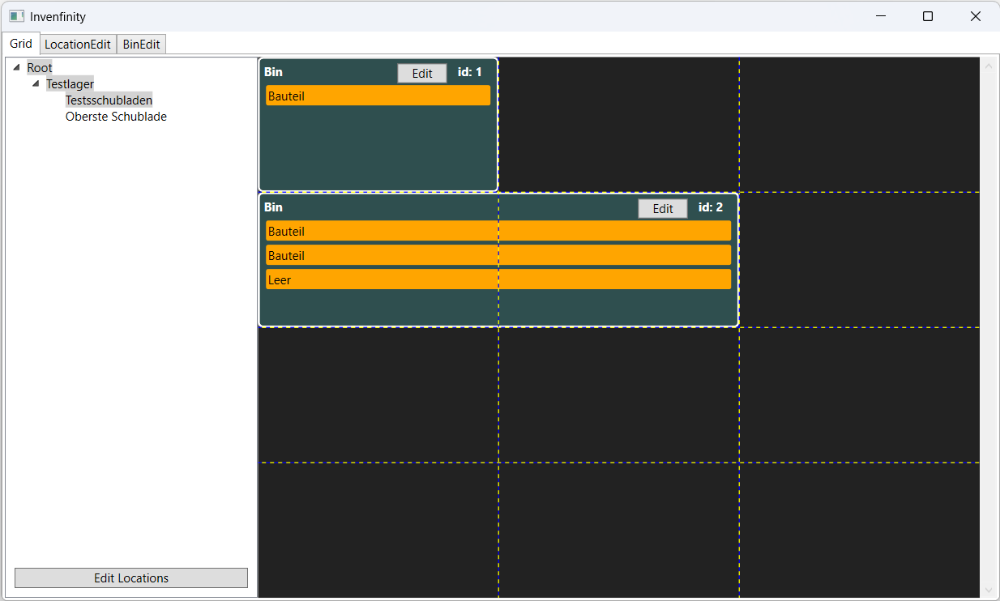
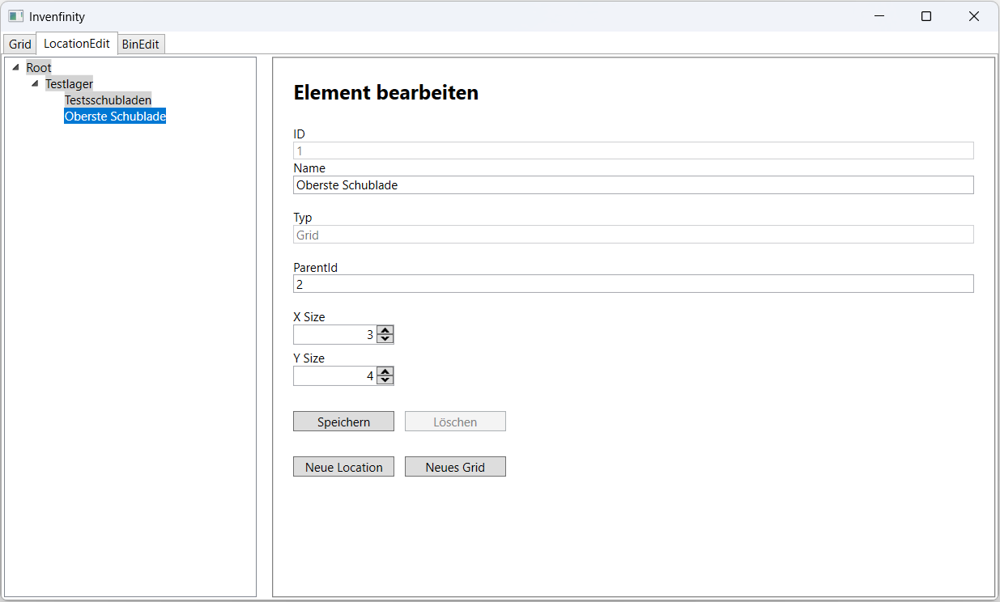
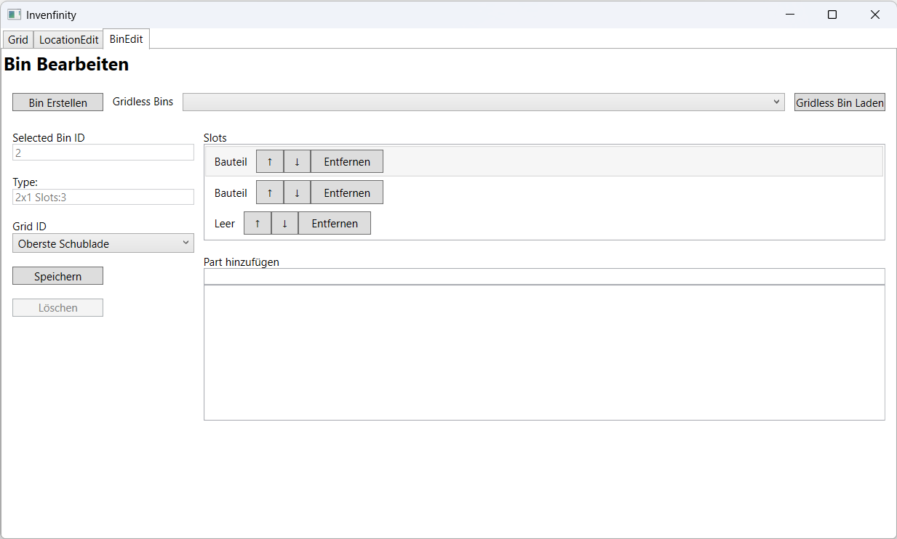

# Invenfinety





## Setup

``` ps
docker compose run --rm inventree-server invoke update
docker compose up -d
```

[How to Update Inventree](https://docs.inventree.org/en/1.1.x/start/docker_install/#update-images)

[Invnetree.localhost](http://inventree.localhost/)

## Useful Commands

### Generate DB Models

``` ps
dotnet ef dbcontext scaffold "Host=localhost;Port=5433;Database=initexample;Username=postgres;Password=initexample" Npgsql.EntityFrameworkCore.PostgreSQL --output-dir Models --context AppDbContext --force
```

### SVG Icon Generation

``` ps
FreeCADCmd -c "exec(open('FastenerGenerator.py').read())"
https://wiki.freecad.org/Fasteners_Workbench
```

### Klassendiagramm generation

``` ps
puml-gen ".\Backend\" .\umlBackend -dir
java -jar C:\tools\plantuml\plantuml.jar -tsvg .\umlBackend\include.puml
```

### Testprotokoll

``` ps
dotnet test --logger "trx;LogFileName=testresults.trx"
trxlog2html -i TestResults/testresults.trx -o TestResults/report.html
```
